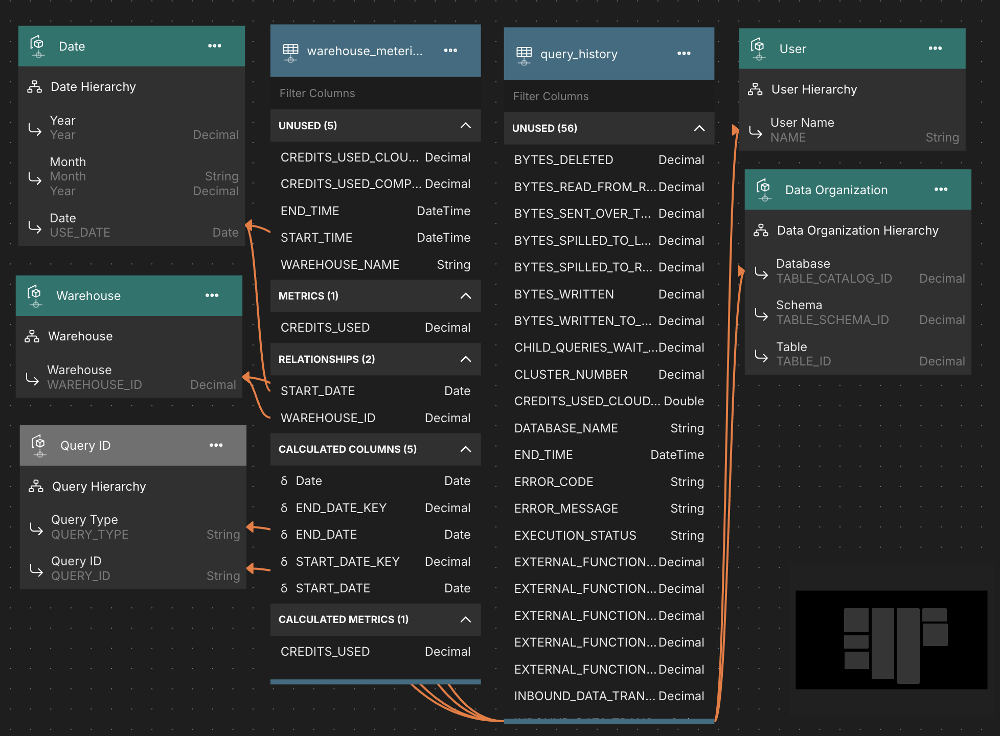

# Snowflake Usage Model

The Snowflake usage model is a semantic model built on top of Snowflake's system tables. You can use this semantic model to analyze and manage your Snowflake credit consumption and usage.

## Demonstrated Model Features
1. Multi-fact model
2. Calculated Columns
3. Query Dataset

## Supported Data Platforms
1. Snowflake

## Data Model Overview

## Data Loading Instructions

The data to support this model is in the **SNOWFLAKE** database and **ACCOUNT_USAGE** schema. As long as your log in has access to this database and schema, the semantic model will work.

## Additional Resources

[Quick Start Video](https://www.atscale.com/resource/quick-tour-community-edition)

[How to connect to Snowflake Video](https://www.atscale.com/resource/how-to-connect-to-snowflake)